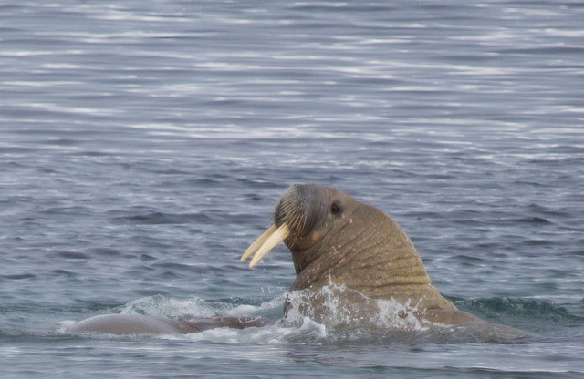

# Walrus
Data analysis pipelines on a single Docker host

Image by [Claire Bates](https://www.flickr.com/photos/13634528@N07/3740697798/in/photolist-6Gy48C-88RXMi-2HWbmX-88dNkA-7Wp4jK-6Gy3Xu-2J23nQ-2J1pzd-2HWD4D-C9UFe-4XLCPH-c6ee9Y-2J1Hd1-nvq94z-2HWrpK-2HVUqX-4zWd3f-efUssu-612vGz-6FT1gy-9rrWvq-2HWPmH-5TxTHQ-2J1vMu-2HWjxP-6VFzzB-6z39PL-2J1SQw-21Scs-4LWTNy-dn5gCs-2HWo3v-2HWMfg-4F7nGW-amSXUp-2HW8eP-2J1Qi5-FWwPz-4JxKnv-4Bgp5Y-ndpXu-9e5DYx-2HWhP4-kn82BD-677cTF-4nzp9v-91tC26-8R5krU-dhmPuC-4WW1pR). 

# Name
Because every data analysis framework has to be named after a big animal.
Right? 

> There is something remarkably fantastic and prehistoric about these monsters. I could not help thinking of a merman, or something of the kind, as it lay there just under the surface of the water, blowing and snorting for quite a long while at a time, and glaring at us with its round glassy eyes. 
> - Fridtjof Nansen on walruses 
